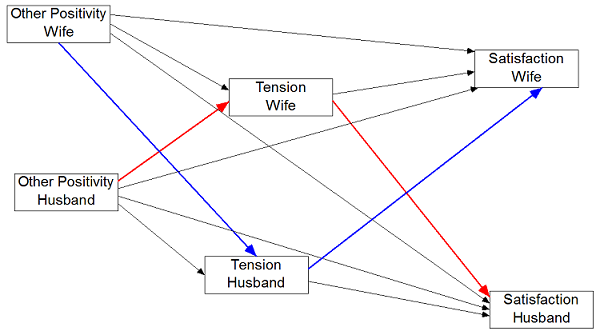

Within the APIM both the causal variable and the mediator may be several variables and so it can be quite complicated. 

##Mediator between-dyads or within-dyads (2-1-2 Mediation)  

* Indistinguishable Dyads
  + 2 Indirect Effects
    - Actor-Mediator (Blue-Green and Red-Tan)
    - Partner-Mediator (Red-Green and Blue-Tan)
* Distinguishable Dyads (Boss and Employee)
  + 4 Indirect Effects
    - Actor-Mediator
      + Boss (Blue-Green)
      + Employee (Red-Tan)
    - Partner-Mediator
      + Boss (Blue-Tan)
      + Employee (Red-Green)

\  

##Mediator mixed variable with actor and partner effects (2-2-2 Mediation)  
* Indistinguishable Dyads: 4 Possible Mediating or Indirect Effects 
  + For the Actor Effect
    - Actor-Actor
    - Partner-Partner
  + For the Partner Effect
    - Actor-Partner
    - Partner-Actor
* Distinguishable Dyads: 8 Indirect Effects
  + Actor-Actor: Husband and Wife
  + Partner-Partner: Husband and Wife
  + Actor-Partner: Husband and Wife
  + Partner-Actor: Husband and Wife
		
#Example: Acitelli Data
##Distinguishable Dyads with a Mixed Mediator  
**Predictor**: Other Positivitity  
**Mediator**: Tension (mixed)  
**Outcome**: Satisfaction

There are four total effects (c) that can be mediated:

1. Wife Actor Effect from Other Positivity (Wife) to Satisfaction (Wife)
2. Husband Actor Effect from Other Positivity (Husband) to Satisfaction (Husband)
3. H to W Partner Effect from Other Positivity (Husband) to Satisfaction (Wife)
4. W to H Partner Effect from Other Positivity (Wife) to Satisfaction (Husband)

Each of the four total effects had two indirect effects, creating are eight mediated or indirect effects.  They each involve a tracing from Other Positivity to Satisfaction via Tension.  Each indirect effect involves the product of two effects: a path from Other Positivity to Tension (a path) times a path from Tension to Satisfaction (b path). To differentiate effects, we note whose Satisfaction score we have.  So ActorW is the actor effect for the wife and PartnerW is the partner effect for wife where the wife provides the outcome variable.  

The four effects to be mediated and their two indirect effects are:

1. Actor: Wife
  + ActorW-ActorW: Wife
  + PartnerHW-PartnerWH: Wife
2. Actor: Husband
  + ActorH-ActorH: Husband
  + PartnerWH-PartnerHW: Husband
3. Partner: Wife 
  + ActorH-PartnerHW: Wife
  + PartnerHW-ActorW: Wife
4. Partner: Husband
  + ActorW-PartnerWH: Husband
  + PartnerWH-ActorH: Husband

For example, "PartnerWH-PartnerHW: Wife" is the path from wife's perception of positivity to husband's feeling of tension times the path from husband's feeling of tension to the wife's satisfaction.  

##1. Actor-Actor  

\  

##2. Partner-Partner  

\  

##3. Actor-Partner  

\  

##4. Partner-Actor  

\  

#Data Example
Read in the individual data (or a pairwise dataset) 

```{r}
library(tidyr)
library(dplyr)
library(nlme)

acitelli_ind <- read.csv(file.choose(), header=TRUE)
```

Convert individual data to pairwise. 

```{r}
tempA <- acitelli_ind %>% 
  mutate(genderE = gender, partnum = 1) %>%
  mutate(gender = ifelse(gender == 1, "A", "P")) %>%
  gather(variable, value, self_pos:genderE) %>%
  unite(var_gender, variable, gender) %>%
  spread(var_gender, value)

tempB <- acitelli_ind %>% 
  mutate(genderE = gender, partnum = 2) %>%
  mutate(gender = ifelse(gender == 1, "P", "A")) %>%
  gather(variable, value, self_pos:genderE)%>%
  unite(var_gender, variable, gender) %>%
  spread(var_gender, value)

acitelli_pair <- bind_rows(tempA, tempB) %>%
  arrange(cuplid) %>%
  mutate(gender_A = ifelse(genderE_A == 1, "hus", "wife"), 
         gender_A = as.factor(gender_A)) 
  
rm(tempA, tempB)
```


##The Four Baron & Kenny Steps Using Multilevel Modeling

###Step 1: Estimating and testing the total effect (c) of Other Positivity (X) on Satisfaction (Y)

```{r}
apim_stp1 <- gls(satisfaction_A ~ gender_A + other_pos_A:gender_A + other_pos_P:gender_A - 1,
                 data = acitelli_pair,
                 correlation = corCompSymm(form=~1|cuplid), 
                 weights = varIdent(form=~1|genderE_A), 
                 na.action = na.omit)

summary(apim_stp1)
```

####Interpretation: All four paths are positive and statistically significant:Seeing your partner positively leads you and your partner to be more satisfied.  All four of these paths could potentially be mediated.

###Step 2: Testing the effects of the Other Positivity (X) on the mediators of Wife and Husband Tension (M).

```{r}
apim_stp2 <- gls(tension_A ~ gender_A + other_pos_A:gender_A + other_pos_P:gender_A - 1,
                 data = acitelli_pair,
                 correlation = corCompSymm(form=~1|cuplid), 
                 weights = varIdent(form=~1|genderE_A), 
                 na.action = na.omit)

summary(apim_stp2)
```

####Interpretation: All four paths of the "a" paths are negative and statistically significant: Seeing your partner positively leads you and your partner to have lower levels of tension.

###Steps 3 and 4: Testing the effects of the Tension (M) and Other Positivity (X) on the Satisfaction (Y). 

```{r}
apim_stp3 <- gls(satisfaction_A ~ gender_A + other_pos_A:gender_A + other_pos_P:gender_A 
                 + tension_A:gender_A + tension_P:gender_A - 1,
                 data = acitelli_pair,
                 correlation = corCompSymm(form=~1|cuplid), 
                 weights = varIdent(form=~1|genderE_A), 
                 na.action = na.omit)

summary(apim_stp3)
```

####Interpretation:    
**Step 3**: All four "b" paths from Tension to Satisfaction are negative and three are statistically significant:  Seeing more tension in the relationship leads to less satisfaction for you and your partner, even after controlling for how positively you and your partner see each other. The one effect that is not statistically significant is the effect of male's level of tension on his wife's level of satisfaction.   
**Step 4**: All paths from Other Positivity to Satisfaction, the direct of c', are positive and statistically significant: Seeing your partner positively leads you and your partner to have higher levels of satisfaction, even after controlling for yours and your partner's tension.

\  

(Figure drawn in Amos.  You might want to drop curved lines and error terms.)  

#Testing Indirect Effects Using Multilevel Modeling

* Sobel Test
  + Save effect estimates and standard errors.
    - Compute Z test.
    - Low power.
* Separately Test a and b
  + Old fashioned.
  + But may be making a comeback.
* Bootstrapping
  + Difficult currently
  + See Pituch & Stapleton (Multivariate Behavioral Research, 2008) for a discussion of how to bootstrap in MLM.
  + Option available in some MLM programs. Only for effects but not indirect effects.
* Monte Carlo Method
  + Appears to be the method of choice for MLMeM  


```{r}
#Function that returns mcmc CI. 
mcmamCI <- function(aval, bval, varA, varB, n){

#code (Selig & Preacher, 2008).
  require(MASS)
  
  a=aval
  b=bval
  rep=n
  conf=95
  pest=c(a,b)
  acov <- matrix(c(varA, 0, 0, varB),2,2)

  mcmc <- mvrnorm(rep,pest,acov,empirical=FALSE)

  ab <- mcmc[,1]*mcmc[,2]

  low=(1-conf/100)/2
  upp=((1-conf/100)/2)+(conf/100)

  LL=quantile(ab,low)
  UL=quantile(ab,upp)
  LL=format(LL,digits=3)
  UL=format(UL,digits=3)

  CI <- cbind.data.frame(LL, UL)
  return(CI)

}
```

For example, we can find the MCMC 95% CI for the **Actor-Actor: Husband** indirect effect like this.

```{r}
act_H_a <- coef(summary(apim_stp2))[3,1]
act_H_a_se <- coef(summary(apim_stp2))[3,2]
act_H_b <- coef(summary(apim_stp3))[7,1]
act_H_b_se <- coef(summary(apim_stp3))[7,2]

mcmamCI(act_H_a, act_H_b, act_H_a_se^2, act_H_b_se^2, 3000)
```

	
	
##Summary of Indirect Effects

|Name	|Indirect Effects	|Estim.|	p	|95% CI^a^ Lower|	Upper|
|:---:|:---------------:|:----:|:--:|:---:|:----:|
|Actor-Actor: W	|Xw -> Mw -> Yw|	0.165|	<.001|	0.086|	0.257|
|Actor-Actor: H	|Xh -> Mh -> Yh|	0.099|	<.001|	0.042|	0.172|
|Partner-Partner: W|	Xw -> Mh -> Yw|	0.027|	.090|	-0.003|	0.070|
|Partner-Partner: H|	Xh -> Mw -> Yh|	0.034|	.024|	0.003|	0.079|
|Actor-Partner: W|	Xh -> Mh -> Yw|	0.038|	.086|	-0.005|	0.092|
|Actor-Partner: H|	Xw -> Mw -> Yh|	0.060|	.004|	0.017|	0.115|
|Partner-Actor: W|	Xh -> Mw -> Yw|	0.094|	.023|	0.013|	0.186|
|Partner-Actor: H|	Xw -> Mh -> Yh|	0.072|	.003|	0.023|	0.134|

^a^Bootstrapped CI using MCM
(The above table was produced by an Excel spreadsheet: IndirectEffects.xls.)

##Summary Direct and Total Effects
|Name|	Direct Effects	|Direct|	p	|Total^a^|	% Mediated|
|:---:|:---------------:|:----:|:--:|:---:|:---:|
|Actor: Wife|	Xw ->  Yw |	0.185	| .007|	0.378|	50.9|
|Actor: Husband|	Xh ->  Yh |	0.291|	<.001|	0.424|	31.5|
|Partner: Wife|	Xh ->  Yw |	0.190|	.010|	0.321|	40.9|
|Partner: Husband|	Xw ->  Yh |	0.129|	.028|	0.262|	50.8|

^a^Computed as `ab + c'` and `c` with results agreeing.  

Note that `% Mediated` equals `ab/c` or equivalently `1 - c'/c`.  This value can be larger than one or negative.  First, make sure that `c` is substantial.  If it is, then if `% Mediated` is greater than 100 or negative, you have "inconsistent mediation":  the direct and indirect effects are of opposite signs.

####Interpretation:  
**Actor-Actor: Wife** ---Wives who see their husbands positively report less tension and are more satisfied.  
**Actor-Actor: Husband** ---Husbands who see their wives positively report less tension and are more satisfied.  
**Partner-Partner: Wife** ---Wives who see their husbands positively have husbands who report less tension and the wives are more satisfied.  
**Partner-Partner: Husband** ---Husbands who see their wives positively have wives who report less tension and the husbands are more satisfied.  
**Actor-Partner: Wife** ---Husbands who see their wives positively report less tension and have wives who are more satisfied.  
**Actor-Partner: Husband** ---Wives who see their husband positively report less tension and have husbands who are more satisfied.  
**Partner-Actor: Wife** ---Husbands who see their wives positively have wives who report less tension and the wives are more satisfied.  
**Partner-Actor: Husband** ---Wives who see their husbands positively have husbands who report less tension and the husbands are more satisfied.  

